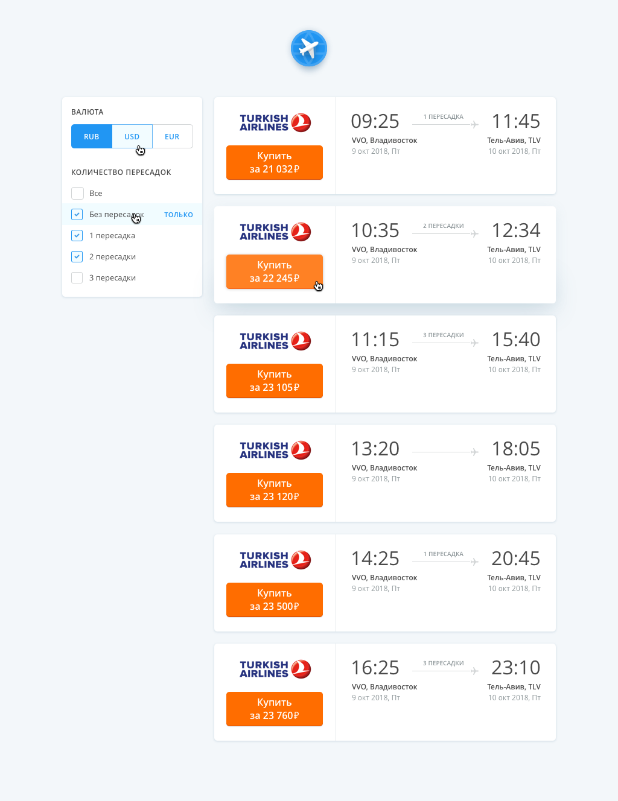

# Aviasales on Steroids



### What's been done? Everything and even more!
* `#task1` Ticket rendering


* `#task2` Ticket filtering


* `#task3` Currency switching (fetching fresh data from `api`)


* `#task4` Ticket, filter, and currency switch layout

* `#task5` Responsiveness down to 320px of your choice

* `#task6` Make the ticket JSON load asynchronously from a local server on initialization (oh, there's much more than just that)

---

### How to run?

1. First, start the `api` (dev version):
```bash
cd api/
npm i
npm start # localhost:3000. Can be changed in .env
```
2. Then the UI `client` (dev version):
```bash
cd client/
npm i
npm start # localhost:9000
```

---

### Why didn't I use Redux, and why is GraphQL here?

I wanted to try `GraphQL` and implement state management with `hooks`. I know it would have been much simpler with `Redux`, but it was more interesting to do the test task this way. And if it doesn't work out, I still gained experience using fun combinations :)

### How does it work in the last two versions of desktop browsers (IE, Chrome, Safari, Firefox)?
There shouldn't be any problems with any of them except IE (I didn't test it, too lazy, I regret my decision). But `Babel` and the `can I use` website suggest that it should work fine. I didn't use any experimental CSS features.

### In general, enjoy :)
